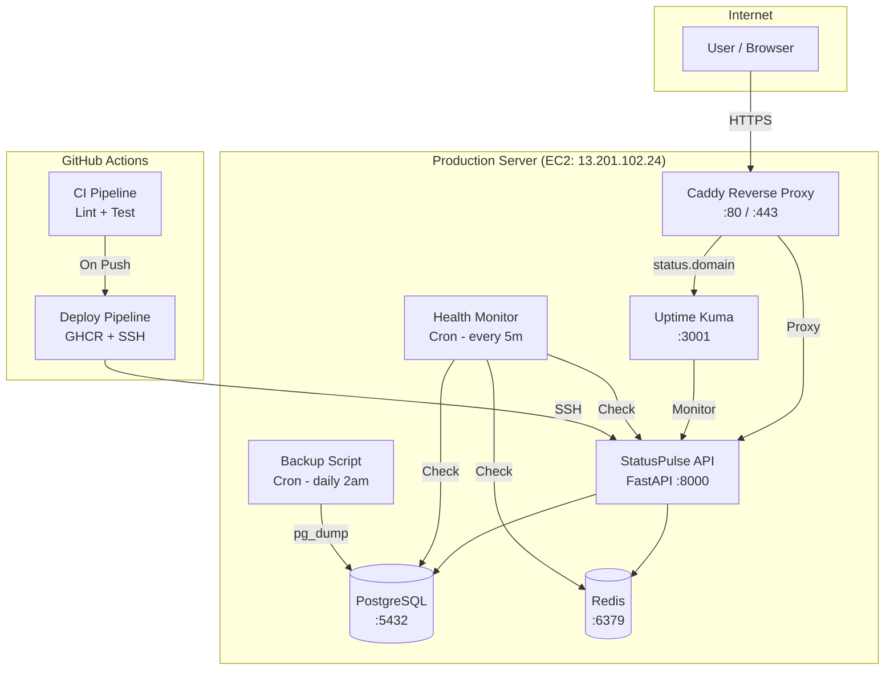

# StatusPulse 🟢

A lightweight status page and health monitoring API built with FastAPI, PostgreSQL, and Redis. Fully Dockerized with CI/CD, monitoring, and Infrastructure as Code.

## Architecture



## Repository Structure

```
statuspulse/
├── .github/workflows/
│   ├── ci.yml              # CI pipeline (lint, test, scan)
│   └── deploy.yml          # CD pipeline (build, push, deploy)
├── app/
│   ├── main.py             # FastAPI application
│   └── requirements.txt    # Python dependencies
├── caddy/
│   └── Caddyfile           # Reverse proxy config
├── scripts/
│   ├── deploy.sh           # Zero-downtime deployment
│   ├── health-monitor.sh   # Health monitoring cron job
│   └── backup.sh           # Database backup script
├── terraform/
│   ├── main.tf             # Infrastructure definition
│   ├── variables.tf        # Terraform variables
│   ├── cloud-init.yaml     # Server bootstrap template
│   └── README.md           # IaC instructions
├── tests/
│   └── test_integration.sh # Integration test suite
├── .dockerignore
├── .env.example
├── .gitignore
├── docker-compose.yml
├── Dockerfile
├── Makefile
├── README.md
└── SECURITY.md
```

## Live Status

- **Status Page**: [https://statuspulse-tushar.duckdns.org/status](https://statuspulse-tushar.duckdns.org/status)
- **API Health**: [https://statuspulse-tushar.duckdns.org/health](https://statuspulse-tushar.duckdns.org/health)
- **API Docs**: [https://statuspulse-tushar.duckdns.org/docs](https://statuspulse-tushar.duckdns.org/docs)

## Prerequisites

- [Docker](https://docs.docker.com/get-docker/) >= 20.10
- [Docker Compose](https://docs.docker.com/compose/install/) >= 2.0
- [Git](https://git-scm.com/)
- (Optional) [Terraform](https://developer.hashicorp.com/terraform/downloads) >= 1.0 for IaC
- (Optional) AWS CLI for S3 backups

## Quick Start — Local Development

```bash
# 1. Clone the repository
git clone https://github.com/your-username/statuspulse.git
cd statuspulse

# 2. Create environment file
cp .env.example .env

# 3. Build and start all services
make build
make up

# 4. Verify it works
make test
# Or manually:
curl http://localhost:8000/health

# 5. View API docs
# Open http://localhost:8000/docs in your browser

# 6. View logs
make logs

# 7. Stop everything
make down

# 8. Clean up (removes volumes)
make clean
```

## API Endpoints

| Method | Endpoint | Description | Status Codes |
|--------|----------|-------------|--------------|
| `GET` | `/` | Root — service info | 200 |
| `GET` | `/health` | Health check (API, DB, Redis) | 200 |
| `GET` | `/docs` | Swagger UI documentation | 200 |
| `POST` | `/services` | Register a new service | 201, 409 |
| `GET` | `/services` | List all services | 200 |
| `POST` | `/incidents` | Create an incident | 201 |
| `GET` | `/incidents` | List all incidents | 200 |

## Production Deployment

### Option 1: Terraform (Recommended)

```bash
cd terraform/
terraform init
terraform plan -var="key_name=my-key" -var="domain_name=status.example.com" -var="admin_email=admin@example.com"
terraform apply
```

See [terraform/README.md](terraform/README.md) for full instructions.

### Option 2: Manual Server Setup

1. Provision an Ubuntu 22.04 server
2. SSH in and install Docker:
   ```bash
   curl -fsSL https://get.docker.com | bash
   ```
3. Clone and deploy:
   ```bash
   git clone <repo> ~/statuspulse && cd ~/statuspulse
   cp .env.example .env
   # Edit .env with production values
   docker compose up -d
   ```

### DNS Configuration

Point your domain's A record to your server's public IP:
```
status.example.com  →  A  →  <server-ip>
```

## CI/CD Pipeline

### CI (`.github/workflows/ci.yml`)

Triggered on every **push** and **pull request** to `main`:

1. **Lint** — Python code with `ruff`
2. **Scan** — Dockerfile with `hadolint`
3. **Build** — Docker image
4. **Test** — Start full stack, run integration tests
5. **Teardown** — Clean up containers

### CD (`.github/workflows/deploy.yml`)

Triggered on push to `main` **after CI passes**:

1. Build and tag image with commit SHA
2. Push to GitHub Container Registry (ghcr.io)
3. SSH into production server
4. Run zero-downtime deployment script
5. Health check → rollback if failed
6. Send webhook notification

### Required GitHub Secrets

| Secret | Description |
|--------|-------------|
| `SERVER_HOST` | Production server IP or hostname |
| `SERVER_USER` | SSH username (e.g., `deploy`) |
| `SERVER_SSH_KEY` | Private SSH key for deployment |
| `ALERT_WEBHOOK_URL` | Webhook URL for notifications |

## Monitoring

### Uptime Kuma

Access at `https://status.yourdomain.com` — monitors:

- API health endpoint (`/health`)
- PostgreSQL connectivity
- Redis connectivity
- TLS certificate expiry

### Health Monitor Script

Runs every **5 minutes** via cron:

- ✅ Application `/health` endpoint
- ✅ Disk usage > 80% alert
- ✅ Memory usage > 90% alert
- ✅ Docker container status
- ✅ TLS certificate expiry < 14 days

Logs to `/var/log/statuspulse-monitor.log`

## Backups

Daily PostgreSQL backups at **2:00 AM** via cron:

- Dumps to compressed `.sql.gz` files
- Retains last **7 backups** (auto-rotation)
- Optional upload to **S3** (set `S3_BUCKET` in `.env`)
- Logs to `/var/log/statuspulse-backup.log`

Manual backup:
```bash
bash scripts/backup.sh
```

## Troubleshooting

| Problem | Solution |
|---------|----------|
| App not starting | Check logs: `make logs` or `docker compose logs app` |
| Database connection error | Verify `DB_*` variables in `.env` match `docker-compose.yml` |
| Redis connection refused | Ensure `REDIS_PASSWORD` matches in `.env` |
| Port 8000 already in use | Stop conflicting process or change port in `docker-compose.yml` |
| Health check failing | Check all 3 services are running: `docker compose ps` |
| TLS not working | Ensure DNS points to server IP, Caddy handles cert auto-renewal |
| CI failing on lint | Run `ruff check .` locally and fix issues |

## Security

See [SECURITY.md](SECURITY.md) for details on:

- Secret management
- Container image scanning
- Network security & firewall
- Security headers
- Vulnerability reporting

## License

MIT
